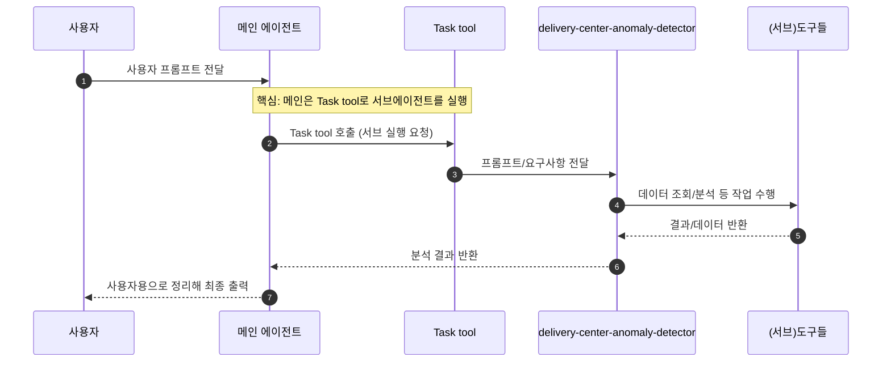

## 들어가며

Anthropic의 문서를 보면 에이전트 워크플로우 패턴이 잘 정리되어 있다.
- [Building effective agents](https://www.anthropic.com/engineering/building-effective-agents)


이 시리즈에서는 서브에이전트를 활용한 다양한 워크플로우 패턴을 다룬다.
해당 첫 번째 글에서는 서브에이전트와 메인에이전트가 어떻게 대화를 주고받는지를 살펴본다.

서브에이전트에 대한 기본 개념과 생성 방법은 아래 글을 참고하자.
- [Claude Code로 빌드하기 - 서브에이전트](https://code.claude.com/docs/ko/sub-agents)


## 실습용 서브에이전트 생성하기

제작 방법은 여러가지가 있지만, Claude Code에서 `/agents` 명령어로 커스텀 서브에이전트를 만들 수 있다.
매우 간단한 서브에이전트를 만들어 보자.

> 배송메트릭을 분석하고 IQR 이상치 탐지 기법을 활용하는 에이전트를 만들어주세요.

에이전트에 쥐어줄 도구는 생성 시 직접 선택할 수 있다.
MCP 도구들 중, 필요한 것만 골라주면 된다. 내경우 아래 2가지를 선택했다.

- get_delivery_init_data 
- get_daily_delivery_metrics

**서브에이전트에 사용할 도구는 꼭 필요한것만 골라주는것이 컨텍스트윈도우 관리에 유리하다.**
- 추후 컨텍스트윈도우에 대해 작성 예정


생성된 에이전트의 명세는 아래와 같다 :

```yaml
# 이름이나 설명은 클로드가 알아서 생성 해 줬다.
name: delivery-center-anomaly-detector
description: 배송센터 메트릭 분석 및 IQR 기법 이상치 탐지
tools: get_delivery_init_data, get_daily_delivery_metrics
model: sonnet
```

## 에이전트 실행하기

만들어둔 에이전트는 메인 에이전트가 Task tool로 호출한다.

사용자 프롬프트 예시:

```
아래 5개의 배송센터의 메트릭을 확인하세요.
배송센터별로 이상치를 벗어났던 날자들을 판별하세요. (IQR 기법을 이용하세요.)
delivery-center-anomaly-detector 를 활용하세요.

이상치 탐지 작업이 완료되면, 최종결과물을 html 로 레포트 하세요.

## 탐색 범위
- 배송예정일 : 2025-07-14 ~ 2025-08-14
- 배송센터 : A,B,R,S,F

---

⏺ 배송센터 메트릭 분석과 이상치 탐지 작업을 시작하겠습니다.

⏺ delivery-center-anomaly-detector(배송센터 이상치 탐지)
  ⎿ Done (0 tool uses · 32.1k tokens · 5m 35s)

∴ Thought for 4s (ctrl+o to show thinking)

✽ 배송센터 이상치 분석 중… (esc to interrupt · ctrl+t to hide todos · 7m 39s · ↓ 7.3k tokens)
  ⎿ ☐ delivery-center-anomaly-detector를 사용하여 배송센터 A, B, R, S, F의 이상치 분석 (2025-07-14 ~ 2025-08-14, IQR 기법)
     ☐ 분석 결과를 HTML 레포트로 작성
```

## 메인 ↔ 서브 실행 흐름 정리


### 플로우 다이어그램

메인에이전트와 서브에이전트 간에는 프롬프트를 주고받는다.
대략적인 흐름은 다음과 같다 : 



### 대화내용 살펴보기

실제로 서브에이전트에 전달되는 프롬프트 출력을 볼수 있다. (ctrl+o 입력하여 엿볼수 있음)
메인 에이전트가 서브에이전트를 호출할 때, 다음과 같이 굉장히 상세한 요청사항을 전달 한 것이다.


```
∴ Thinking…

  사용자가 배송센터의 메트릭을 확인하고 IQR 기법을 사용하여 이상치를 탐지하도록 요청하고 있습니다. 그리고 delivery-center-anomaly-detector 에이전트를 활용하라고 명시적으로
  지시하고 있습니다.

  요청 사항:
  1. 5개의 배송센터 (A, B, R, S, F)의 메트릭 확인
  2. IQR 기법을 사용하여 이상치를 벗어난 날짜 판별
  3. delivery-center-anomaly-detector 에이전트 활용
  4. 배송예정일 범위: 2025-07-14 ~ 2025-08-14
  5. 최종 결과물을 HTML 레포트로 작성

  agent 설명을 보면:
  - delivery-center-anomaly-detector: "Use this agent when you need to analyze delivery center metrics and identify anomalous dates using statistical methods."

  이것이 정확히 맞는 상황입니다. 사용자가 배송센터 메트릭 분석과 IQR 방법을 사용한 이상치 탐지를 요청하고 있습니다.

  먼저 Task tool을 사용하여 delivery-center-anomaly-detector 에이전트를 실행해야 합니다. 그런 다음 결과를 받아서 HTML 레포트를 작성해야 합니다.

  TodoWrite tool을 사용하여 작업을 계획하겠습니다:
  1.

  에이전트를 통해 배송센터의 이상치를 분석하고 통계적 방법으로 특이점을 식별합니다. 지정된 날짜 범위 내에서 IQR 기법을 적용하여 메트릭의 비정상적인 패턴을 찾아내겠습니다.

⏺ 배송센터 메트릭 분석과 이상치 탐지 작업을 시작하겠습니다.  

⏺ delivery-center-anomaly-detector(배송센터 이상치 탐지)
  ⎿  Prompt:
       다음 배송센터들의 메트릭을 확인하고 IQR 기법을 사용하여 이상치를 벗어난 날짜들을 판별하세요:

       **탐색 범위:**
       - 배송예정일: 2025-07-14 ~ 2025-08-14
       - 배송센터: A, B, R, S, F

       **수행할 작업:**
       1. 각 배송센터(A, B, R, S, F)의 메트릭 데이터를 조회
       2. IQR(Interquartile Range) 기법을 사용하여 각 배송센터별로 이상치(anomaly)를 탐지
       3. 이상치로 판별된 날짜들과 해당 메트릭 값을 식별

       **반환해야 할 정보:**
       - 각 배송센터별 분석 결과 (정상 범위, 이상치 기준)
       - 배송센터별로 이상치가 탐지된 날짜 목록과 해당 메트릭 값
       - IQR 계산 결과 (Q1, Q3, IQR, 하한/상한 경계값)
       - 각 이상치에 대한 상세 정보

       모든 배송센터에 대해 체계적으로 분석하고 결과를 명확하게 정리하여 반환해주세요.

     > 다음 배송센터들의 메트릭을 확인하고 IQR 기법을 사용하여 이상치를 벗어난 날짜들을 판별하세요:
```

**아래의 대화내용도 사실은 토큰을 텍스트로 변환 출력한 것으로 보인다.**
**실제 주고받는 내용은 훨씬 길다.**


## 정리

Claude Code의 `/agents` 명령어로 커스텀 서브에이전트를 만들 수 있다.
에이전트에 도구와 시스템 프롬프트를 지정하면, 메인 에이전트가 Task tool로 호출해서 사용한다.
서로의 대화내용은 사용자도 볼수 있다.
다음 글에서는 서브에이전트를 병렬로 실행하고 결과를 취합하는 워크플로우를 다룬다.
