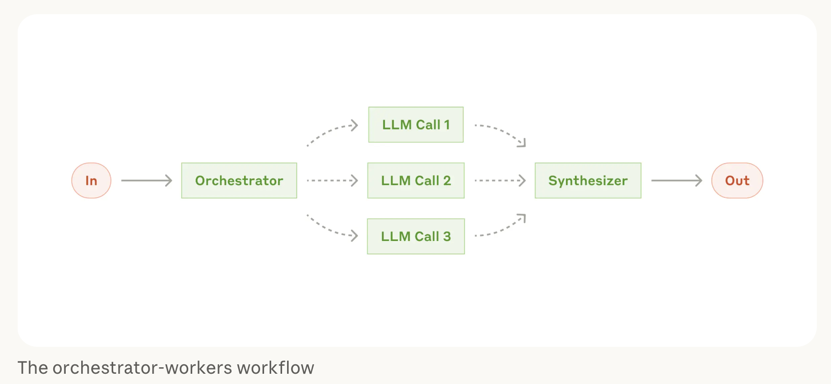
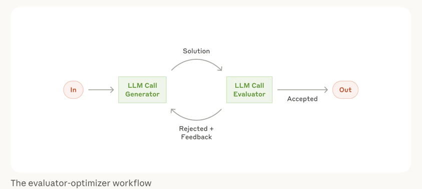

## 오케스트레이터-워커, 평가-최적화 루프

이번 실습에서는 PM, 엔지니어, QA 세 역할이 협업하는 시나리오를 구현했다.
클로드의 여러 패턴으로 대입해 본다면 다음 두 패턴이 혼합된 에이전트들가 될 것이다.

### 오케스트레이터-워커 워크플로우

현실세계의 업무는 PM이 프로젝트 (또는 프로덕트) 작업자들과 오케스트레이션을 한다.
나 (메인에이전트) 는 PM과만 소통을 하는것이 좋다.
때문에 아래와 같은 패턴이라고 볼수 있다.




### 평가-최적화 루프 워크플로우

현실세계의 협업은 PM과 작업자의 단방향으로 이뤄지지 않는다.
여러 직군의 의견을 주고 받으며 반복 교정되기도 한다. 
때문에 아래와 같은 패턴이라고 볼수 있다.





## 실행 프롬프트

클로드코드의 서브에이전트는 /agents 명령어로 생성이 가능하다. 
하지만 재활용을 할게 아니라면, 지금처럼 실습을 위해서라면 아래와같이 프롬프트로 1회성 구축하는것 만으로도 충분하다.


```
3개의 서브에이전트를 만들어 서로 소통하며 최선의 결과물을 만드세요.
Claude Code의 Task tool로 3개 서브에이전트 실행하면 됩니다.
MCP나 도구는 사용하지 말고 현재경로의 엑셀파일을 통해서만 분석 및 결과물을 도출하세요.
각 Task tool 간에 소통하는 과정을 사용자에게 설명하면서 진행하세요.

1. PM (오케스트레이터)
1-1. 데이터를 보고 어떤 인사이트를 제공하면 좋을지 기획
1-2. 엔지니어, QA와 소통하며 기획을 점진적으로 개선

2. 프로덕트 엔지니어
2-1. 기획 내용을 파악하고, 집계 코드 및 데이터 시각화 개발
2-2. 더 좋은 의견이 있으면 실무자 관점에서 PM과 소통

3. QA
3-1. PM과 엔지니어가 개발한 내용의 의도를 이해하고 문제 확인
3-2. 체크리스트를 만들어 통과 여부 판단

각 Task가 완료되면 사용자에게 최종 보고하세요.
```

핵심 포인트:
- **"소통하는 과정을 설명하면서"**: 에이전트 간 대화를 사용자에게 보여줌
- **역할별 책임 명시**: 각 에이전트가 무엇을 해야 하는지 구체적으로 기술
- **파일 기반 소통**: JSON 파일로 요구사항, 피드백, 리포트를 주고받음 
  - JSON 형식을 명시하진 않았으나, 규격에 대한 설명이 md 보다는 비교적 스펙으로써 명확히때문에 에이전트 동작에서 종종 JSON 활용을 보곤 했기때문에 특별히 놀랍진 않았다. 

## 최종 결과물

다음과 같이 PM, 엔지니어, QA 세 에이전트가 **파일로 소통하며 협업** 했다. 
커뮤니케이션이 단방향으로 제작으로 끝나지 않고, 루프를 돌며 **결과물을 계속 보강** 했다.


```
🎉 프로젝트 완료
  3개 서브에이전트 협업 프로세스가 성공적으로 완료되었습니다.
  핵심 성과:
  - PM이 5가지 비즈니스 인사이트 도출
  - 엔지니어가 실행 가능한 분석 시스템 개발 (6종 시각화)
  - QA가 품질 검증 완료 후 프로덕션 배포 승인
  에이전트 간 소통:
  - PM → 엔지니어: 명확한 요구사항 전달
  - 엔지니어 → PM: 9가지 실무 개선 제안
  - QA: 95% 정합성 확인, 2건 Major 이슈 발견

```


프로세스 흐름도는 다음과 같다.

```
PM (기획)
  ↓ pm_requirements.json
  ↓ "5가지 인사이트 + 대시보드 개발 요청"
  ↓
엔지니어 (개발)
  ↓ analyze_delivery.py + 시각화 6종
  ↑ engineer_feedback.json
  ↑ "기대치 초과 달성 + 9가지 피드백"
  ↑
PM ← (피드백 루프 - 개선 제안)
  ↓
QA (검증)
  ↓ qa_report.json
  ↓ "Pass 판정 + 2건 Major 이슈"
  ↓
배포 승인 ✅
```


## 실습하면서 느낀 점

- 역할 분리가 명확하면 결과물 품질이 올라간다 
- 엔지니어가 PM 요구사항을 초과 달성하는 경우도 있다.
- PM-엔지니어-QA 패턴은 실제 협업 구조와 비슷해서 직관적이다
- 에이전트간 파일 기반 소통
  - 장기 프로세스로써 효율적
  - 최종 판단의 근거물
- "소통하는 과정을 설명하면서 진행하세요" 같은 명시적 요구사항이 중요하다


## 정리

PM-엔지니어-QA 세 에이전트가 협업하는 오케스트레이터 패턴을 실습했다.
각 에이전트가 자신의 역할에 집중하고, 파일로 소통하며, 점진적으로 결과물을 개선했다.

실무에서 반복적인 분석 작업이나 리뷰 프로세스에 적용해 볼 만한 가치가 있어 보인다.
역할 설계와 프롬프트 품질이 결과물에 큰 영향을 미친다는 것도 확인했다.
