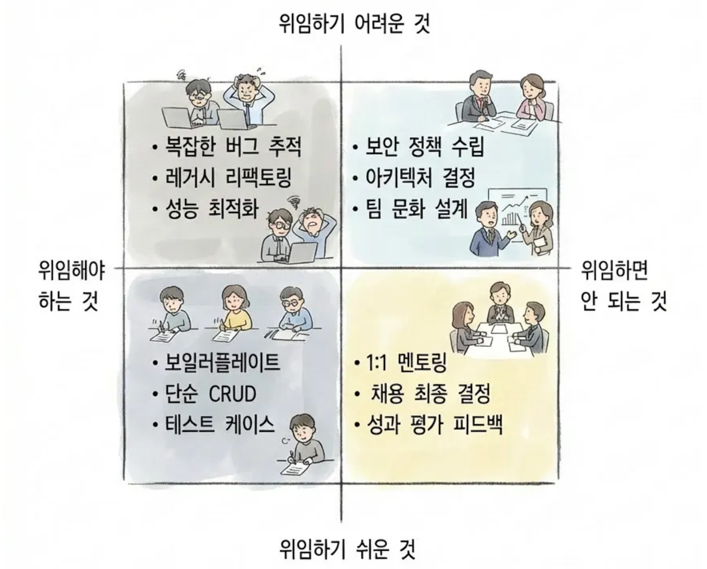

[toss 기술블로그 - 개발자는 AI에게 대체될 것인가](https://toss.tech/article/44377)를 읽고 많은 생각이 들었다.

특히 위임해야 할 것들에 대한 4분면이 인상적이었다.
                                                                                                                                    
*출처: [toss 기술블로그](https://toss.tech/article/44377)*

요약하자면 다음과 같다.

1. 위임 : 잘 정의된 반복 작업 (보일러플레이트 코드, 테스트 생성, 문서화)
2. 위임 : 명확한 입출력이 있는 변환 작업
3. 직접 : 모호하고 맥락 의존적인 의사결정
4. 직접 : 비즈니스 요구사항 해석과 시스템 설계
5. 직접 : AI 결과물의 검증과 품질 판단

여기에, 내가 개발자들에게 절대 위임하지 않았으면 하는 일들도 있다. 