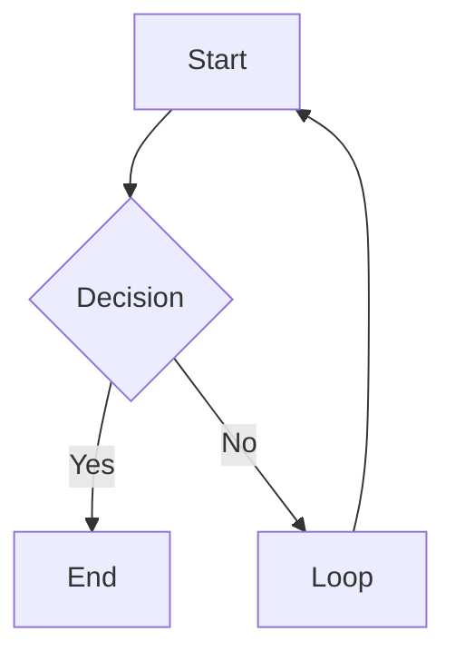

## 이 스킬이 하는 일

`obsidian-markdown`은 Claude가 Obsidian 볼트에 노트를 작성할 때 **Obsidian Flavored Markdown을 정확히 쓰도록 가르치는 레퍼런스 스킬**이다. Wikilink, 임베드, 콜아웃, 프론트매터 프로퍼티, 태그, 수식, Mermaid 다이어그램, 각주까지 — 표준 Markdown과 다른 Obsidian 고유 문법을 정의한다.

왜 별도 스킬이 필요한가? Claude는 기본적으로 표준 Markdown을 출력한다. 내부 링크를 `[text](path/to/note.md)` 형태로 쓰거나, 콜아웃 문법을 잘못 쓰거나, 프론트매터에 ISO 날짜를 쓰는 것이 대표적인 실수다. 이 스킬은 그런 실수를 원천 차단한다.

## 파일 구조

```text title="obsidian-markdown 스킬 파일 트리"
claude-obsidian/
└── skills/obsidian-markdown/
    └── SKILL.md         # 스킬 본체 — Obsidian 마크다운 전체 레퍼런스
```

단일 파일 스킬이다. 232줄의 SKILL.md 하나가 Obsidian 마크다운 문법 전체를 커버한다. `wiki` 스킬이 9개 파일에 걸쳐 93개 개념을 다루는 것과 대조적이다. 이 스킬은 **간결함이 미덕**이다 — Claude가 노트를 쓸 때마다 참조하는 치트시트이기 때문이다.

---

## SKILL.md 뜯어보기

SKILL.md의 프론트매터부터 보자.

```yaml title="skills/obsidian-markdown/SKILL.md"
---
name: obsidian-markdown
description: "Write correct Obsidian Flavored Markdown: wikilinks, embeds,
  callouts, properties, tags, highlights, math, and canvas syntax.
  Reference this when creating or editing any wiki page."
allowed-tools: Read Write Edit
---
```

`description`의 트리거 키워드 목록이 눈에 띈다: `write obsidian note`, `obsidian syntax`, `wikilink`, `callout`, `embed` 등. Claude Code가 이 키워드를 감지하면 자동으로 이 스킬을 로드한다. `allowed-tools`는 `Read Write Edit` 세 가지 — 이 스킬은 파일을 읽고 쓰고 편집하는 것이 전부다.

또 하나 중요한 크로스 레퍼런스가 있다.

```markdown title="skills/obsidian-markdown/SKILL.md"
**Cross-reference**: If the kepano/obsidian-skills plugin is installed,
prefer its canonical obsidian-markdown skill for authoritative Obsidian
syntax reference.
```

kepano는 Obsidian 창시자 Steph Ango의 GitHub 아이디다. 공식 `obsidian-skills` 플러그인이 설치되어 있으면 그쪽을 우선하라는 선언이다. 이 스킬은 공식 플러그인의 **폴백(fallback)** 역할을 한다.

이제 각 섹션을 순서대로 살펴보자.

---

### Wikilinks -- 기본, Alias, Block-Level

Obsidian의 내부 링크는 대괄호 두 개로 감싼다. 표준 Markdown의 `[text](url)` 대신 `[[파일명]]` 문법을 쓴다.

```markdown title="skills/obsidian-markdown/SKILL.md"
| Syntax                        | What it does                  |
|---                            |---                            |
| [[Note Name]]                 | Basic link                    |
| [[Note Name|Display Text]]    | Aliased link                  |
| [[Note Name#Heading]]         | Link to a specific heading    |
| [[Note Name#^block-id]]       | Link to a specific block      |
```

네 가지 형태를 하나씩 보자.

**기본 Wikilink.** `[[Note Name]]`은 가장 기본적인 형태다. 확장자 없이 파일명만 쓴다. Obsidian이 볼트 전체에서 파일명 유니크니스로 해석한다 — 경로를 쓸 필요가 없다. 같은 이름의 파일이 두 개 이상이면 `[[Folder/Note Name]]`으로 명확히 구분한다.

**Aliased Wikilink.** `[[Note Name|Display Text]]`는 파이프 문자 뒤에 표시할 텍스트를 지정한다. 실제 파일명이 길거나 기술적인 경우 유용하다. 예를 들어 `[[yaml-frontmatter-properties|프론트매터]]`처럼 한국어 표시 텍스트를 쓸 수 있다.

**Block-Level Wikilink.** `[[Note Name#^block-id]]`는 특정 블록(문단)을 가리킨다. Obsidian에서 `^` 접두사로 블록 ID를 지정하면 해당 문단에 직접 링크할 수 있다. 헤딩 단위보다 더 세밀한 참조가 가능하다.

SKILL.md가 명시하는 규칙도 중요하다.

```markdown title="skills/obsidian-markdown/SKILL.md"
Rules:
- Case-sensitive on some systems. Match the exact filename.
- No path needed: Obsidian resolves by filename uniqueness.
- If two files have the same name, use [[Folder/Note Name]] to disambiguate.
```

**대소문자 구분**이 시스템에 따라 달라지므로 파일명을 정확히 매칭하라는 주의사항이다. macOS는 기본적으로 case-insensitive지만, Linux에서 동기화하면 문제가 생긴다.

---

### Embeds -- 노트 임베드, 이미지 사이징

임베드는 Wikilink 앞에 느낌표(`!`)를 붙인다. 링크와 달리 내용을 현재 노트에 **인라인으로 렌더링**한다.

```markdown title="skills/obsidian-markdown/SKILL.md"
| Syntax                   | What it does                       |
|---                       |---                                 |
| ![[Note Name]]           | Embed a full note                  |
| ![[Note Name#Heading]]   | Embed a section                    |
| ![[image.png]]           | Embed an image                     |
| ![[image.png|300]]       | Embed image with width 300px       |
| ![[document.pdf]]        | Embed a PDF                        |
| ![[audio.mp3]]           | Embed audio                        |
```

**노트 임베드.** `![[Note Name]]`은 해당 노트 전체를 현재 노트에 삽입한다. `![[Note Name#Heading]]`은 특정 섹션만 삽입한다. 위키에서 개념 페이지를 요약 페이지에 임베드할 때 유용하다.

**이미지 사이징.** `![[image.png|300]]`에서 파이프 뒤의 숫자는 픽셀 너비다. Obsidian 고유 문법이다 — 표준 Markdown의 `` 문법에서는 크기를 지정할 수 없다. Claude가 위키에 이미지를 임베드할 때 이 문법을 알아야 레이아웃이 깨지지 않는다.

PDF와 오디오도 같은 패턴이다. Obsidian이 네이티브로 렌더링해주기 때문에 별도 플러그인 없이 `![[document.pdf]]`, `![[audio.mp3]]`로 임베드할 수 있다.

---

### Callouts -- 기본, 접기, 커스텀 타입

콜아웃은 블록인용(`>`) 안에 `[!type]` 키워드를 넣는 Obsidian 고유 문법이다. 스타일이 적용된 알림 박스로 렌더링된다.

```markdown title="skills/obsidian-markdown/SKILL.md"
> [!note]
> Default informational callout.

> [!note] Custom Title
> Callout with a custom title.

> [!note]- Collapsible (closed by default)
> Click to expand.

> [!note]+ Collapsible (open by default)
> Click to collapse.
```

**기본 콜아웃.** `> [!note]`가 가장 기본 형태다. 타입 키워드 뒤에 텍스트를 추가하면 커스텀 타이틀이 된다.

**접기 콜아웃.** 타입 뒤에 `-`를 붙이면 접힌 상태로 시작하고, `+`를 붙이면 펼쳐진 상태로 시작한다. 길이가 긴 참고 자료나 부가 설명을 넣을 때 유용하다.

**커스텀 타입 전체 목록.** SKILL.md는 14가지 콜아웃 타입을 정의한다.

```markdown title="skills/obsidian-markdown/SKILL.md"
| Type          | Aliases                    | Use for              |
|------         |---------                   |------                |
| note          |                            | General notes        |
| abstract      | summary, tldr              | Summaries            |
| info          |                            | Information          |
| todo          |                            | Action items         |
| tip           | hint, important            | Tips and highlights  |
| success       | check, done                | Positive outcomes    |
| question      | help, faq                  | Open questions       |
| warning       | caution, attention         | Warnings             |
| failure       | fail, missing              | Errors or failures   |
| danger        | error                      | Critical issues      |
| bug           |                            | Known bugs           |
| example       |                            | Examples             |
| quote         | cite                       | Quotations           |
| contradiction |                            | Conflicting info     |
```

마지막 `contradiction`이 눈에 띈다. 이것은 Obsidian 기본 제공이 아니라 **wiki 스킬의 커스텀 콜아웃**이다. 1편에서 다룬 `css-snippets.md`에서 정의한 것으로, 소스 간 모순을 플래그할 때 사용한다. `obsidian-markdown` 스킬이 `wiki` 스킬의 커스텀 콜아웃까지 레퍼런스에 포함시킨 것이다.

SKILL.md 하단의 "What NOT to Do" 섹션에서 콜아웃 관련 주의사항도 명시한다.

```markdown title="skills/obsidian-markdown/SKILL.md"
- Do not use HTML inside callouts: stick to Markdown.
- Do not use ## inside a callout body: headings don't render inside callouts.
```

콜아웃 안에서 HTML을 쓰거나 `##` 헤딩을 쓰면 렌더링이 깨진다. Claude가 자주 하는 실수이기 때문에 명시적으로 금지한 것이다.

---

### YAML Frontmatter Properties

Obsidian은 YAML 프론트매터를 Properties 패널로 렌더링한다. SKILL.md는 정확한 형식을 예제로 보여준다.

```yaml title="skills/obsidian-markdown/SKILL.md"
---
type: concept                    # plain string
title: "Note Title"              # quoted if it contains special chars
created: 2026-04-08              # date as YYYY-MM-DD (not ISO datetime)
updated: 2026-04-08
tags:
  - tag-one                      # list items use - format
  - tag-two
status: developing
related:
  - "[[Other Note]]"             # wikilinks must be quoted in YAML
sources:
  - "[[source-page]]"
---
```

다섯 가지 규칙이 핵심이다.

```markdown title="skills/obsidian-markdown/SKILL.md"
Rules:
- Flat YAML only. Never nest objects.
- Dates as YYYY-MM-DD, not 2026-04-08T00:00:00.
- Lists as - item, not inline [a, b, c].
- Wikilinks in YAML must be quoted: "[[Page]]".
- tags field: Obsidian reads this as the tag list, searchable in vault.
```

1. **평면 YAML만 허용.** 중첩 객체를 쓰면 Obsidian Properties 패널이 제대로 파싱하지 못한다.
2. **날짜는 `YYYY-MM-DD`.** ISO datetime(`2026-04-08T00:00:00Z`)을 쓰면 Obsidian이 날짜가 아닌 문자열로 인식한다.
3. **리스트는 `- item` 형식.** 인라인 `[a, b, c]`도 YAML 스펙상 유효하지만, Obsidian은 `- item` 형식을 선호한다.
4. **YAML 안의 Wikilink는 반드시 따옴표로 감싼다.** `[[Page]]`의 대괄호가 YAML 문법과 충돌하기 때문이다. `"[[Page]]"`로 써야 한다.
5. **`tags` 필드는 Obsidian이 자동으로 태그 목록으로 인식**하여 검색과 필터링에 활용한다.

이 규칙들은 1편에서 다룬 `wiki` 스킬의 `frontmatter.md`와 직접 연결된다. `obsidian-markdown`은 YAML 문법 레벨의 규칙을, `frontmatter.md`는 위키 도메인의 스키마(필드 종류, 상태 라이프사이클 등)를 담당한다.

---

### Tags -- 중첩 태그

태그는 두 가지 형태로 쓸 수 있다.

```markdown title="skills/obsidian-markdown/SKILL.md"
#tag-name             : inline tag anywhere in the body
#parent/child-tag     : nested tag (shows hierarchy in tag pane)
```

**인라인 태그**는 노트 본문 어디에나 `#tag-name`으로 쓸 수 있다. **중첩 태그**는 `/`로 계층을 만든다. `#ai/obsidian`처럼 쓰면 Obsidian의 태그 패인에서 `ai` 아래 `obsidian`이 트리 구조로 표시된다.

프론트매터에서는 `#` 없이 태그명만 쓴다.

```yaml title="skills/obsidian-markdown/SKILL.md"
tags:
  - research
  - ai/obsidian
```

이 구분이 중요하다. 프론트매터 안에서 `#research`라고 쓰면 YAML 주석으로 파싱되어 태그가 사라진다.

---

### 텍스트 서식 -- 하이라이팅

표준 Markdown의 볼드, 이탤릭, 취소선에 더해 Obsidian은 **하이라이팅**을 지원한다.

```markdown title="skills/obsidian-markdown/SKILL.md"
| Syntax              | Result          |
|---                  |---              |
| **bold**            | Bold            |
| *italic*            | Italic          |
| ~~strikethrough~~   | Strikethrough   |
| ==highlight==       | Highlighted text (yellow in Obsidian) |
```

`==텍스트==`로 감싸면 Obsidian에서 노란색 형광펜 효과가 적용된다. 표준 Markdown에는 없는 문법이므로 GitHub 등 다른 렌더러에서는 보이지 않는다. 위키 노트에서 핵심 키워드를 강조할 때 활용한다.

---

### 수식 -- 인라인, 블록

Obsidian은 MathJax/KaTeX를 내장하고 있어 LaTeX 수식을 렌더링할 수 있다.

**인라인 수식.** 달러 기호 하나로 감싼다.

```markdown title="skills/obsidian-markdown/SKILL.md"
$E = mc^2$
```

문장 중간에 `$E = mc^2$`를 쓰면 수식이 인라인으로 렌더링된다.

**블록 수식.** 달러 기호 두 개로 감싸면 독립 블록이 된다.

```markdown title="skills/obsidian-markdown/SKILL.md"
$$
\int_0^\infty e^{-x} dx = 1
$$
```

블록 수식은 가운데 정렬되어 별도 줄에 렌더링된다. 연구 위키에서 수학적 정의나 공식을 기록할 때 필수적이다.

---

### Mermaid Diagrams

Obsidian은 Mermaid를 네이티브로 렌더링한다. 별도 플러그인 설치 없이 코드 블록의 언어를 `mermaid`로 지정하면 된다.

````markdown title="skills/obsidian-markdown/SKILL.md"

````

SKILL.md는 지원하는 다이어그램 타입도 나열한다.

```text title="skills/obsidian-markdown/SKILL.md"
Supported: graph, sequenceDiagram, gantt, classDiagram, pie, flowchart.
```

위키에서 아키텍처 다이어그램, 워크플로우 차트, 시퀀스 다이어그램을 이미지 파일 없이 텍스트로 관리할 수 있다. Git 버전 관리와 궁합이 좋다.

---

### Footnotes

각주는 표준 Markdown Extended Syntax이지만, Obsidian이 네이티브로 지원한다.

```markdown title="skills/obsidian-markdown/SKILL.md"
This sentence has a footnote.[^1]

[^1]: The footnote text goes here.
```

`[^1]`이 본문에서 각주 참조가 되고, `[^1]:`이 각주 내용을 정의한다. Obsidian은 읽기 모드에서 각주를 호버 팝업으로 보여주기 때문에, 부가 설명이나 출처를 깔끔하게 정리할 수 있다.

---

## 다른 스킬과의 연결점

`obsidian-markdown`은 단독으로 존재하지 않는다. 다른 스킬들이 이 스킬의 문법 위에서 동작한다.

**wiki 스킬과의 관계.** `wiki` 스킬의 `frontmatter.md`는 프론트매터의 **스키마**(어떤 필드가 있고, 어떤 값이 허용되는지)를 정의하고, `obsidian-markdown`은 프론트매터의 **문법**(YAML 포맷, 날짜 형식, 따옴표 규칙)을 정의한다. 두 스킬이 상호 보완적이다.

**wiki-ingest와의 관계.** 소스를 인제스트할 때 생성되는 위키 페이지는 이 스킬의 문법을 따라야 한다. Wikilink로 교차 참조를 걸고, 콜아웃으로 핵심 인사이트를 표시하고, 프론트매터로 메타데이터를 기록한다.

**wiki-lint와의 관계.** 린트 스킬이 검사하는 항목 중 상당수가 이 스킬의 규칙 위반이다. 깨진 Wikilink, 잘못된 프론트매터 형식, 빠진 태그 등을 검출한다.

**canvas 스킬과의 관계.** SKILL.md의 `description`에 "canvas syntax"가 포함되어 있다. 캔버스 노드에 Wikilink와 임베드를 쓸 때도 이 스킬의 문법이 적용된다.

**What NOT to Do 섹션.** SKILL.md 마지막에 Claude가 흔히 저지르는 실수 5가지를 명시적으로 금지한다.

```markdown title="skills/obsidian-markdown/SKILL.md"
- Do not use [link text](path/to/note.md) for internal links: use [[Note Name]] instead.
- Do not use HTML inside callouts: stick to Markdown.
- Do not use ## inside a callout body: headings don't render inside callouts.
- Do not write tags: [a, b, c] inline in frontmatter: Obsidian prefers the list format.
- Do not write ISO datetimes in frontmatter (2026-04-08T00:00:00Z): use 2026-04-08.
```

이 "하지 마라" 목록이 이 스킬의 핵심 가치다. 232줄짜리 레퍼런스가 존재하는 이유는 단 하나 — **Claude가 Obsidian 문법을 틀리지 않게 하기 위해서**다.

다음 편에서는 `wiki-ingest` 스킬을 분석한다. 소스 문서를 볼트에 인제스트하는 전체 파이프라인을 코드 레벨에서 뜯어보기할 것이다.
